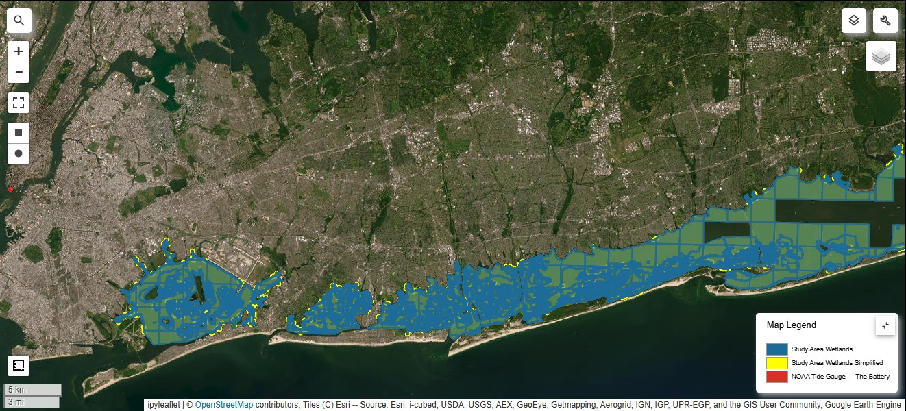
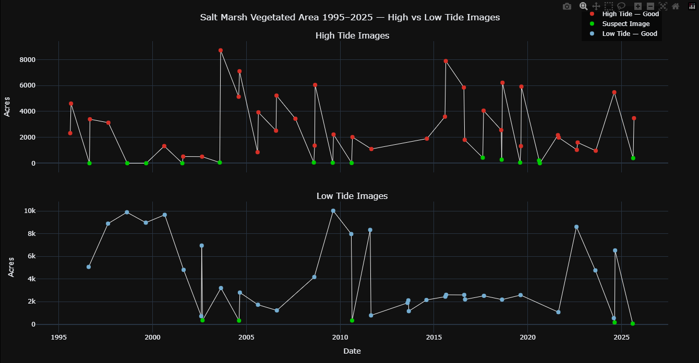

# GEE Spatial Temporal Analysis of Changes in Marsh Vegetation Density
Visualize the spatial temporal changes in marsh vegetation in Queens Jamaica Bay and Long Island's South Bay through a [color image analysis](https://github.com/polanch190/GEE-Spatial-Temporal-Analysis-of-Changes-in-Marsh-Vegetation-Density-/blob/main/Color_composite_Image_NB.ipynb) using 
Google Earth Engine Python API. Validate the results by comparing vegetation acreage loss to tide predictions between the years of 1996 -2025 in an interactive [timeseries analysis](https://github.com/polanch190/GEE-Spatial-Temporal-Analysis-of-Changes-in-Marsh-Vegetation-Density-/blob/main/tide_analysis_GEE_API.ipynb). Dig deeper and click [here](https://github.com/polanch190/ndvi-analysis) to see the statistical analysis of extracted NDVI data in R.

Click this map to explore the wetlands within the study area

Click the chart below to interact with the vegetation acreage and tide timeseries data!

Color image analysis results

